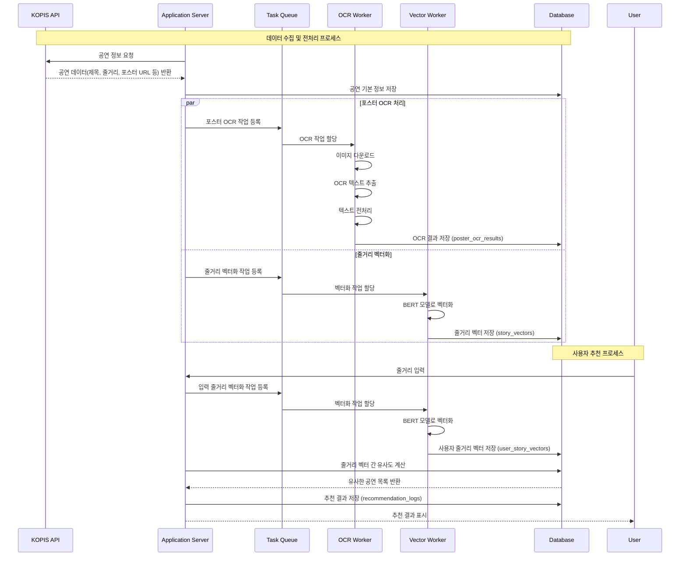

# stage-lens
줄거리 기반 공연 추천 웹앱 서비스 프로젝트

# Sequence Diagram

```mermaid
sequenceDiagram
    participant KOPIS as KOPIS API
    participant App as Application Server
    participant Queue as Task Queue
    participant OCR as OCR Worker
    participant Vector as Vector Worker
    participant DB as Database
    participant User as User

    %% 초기 데이터 수집 및 전처리
    Note over KOPIS,DB: 데이터 수집 및 전처리 프로세스
    App->>KOPIS: 공연 정보 요청
    KOPIS-->>App: 공연 데이터(제목, 줄거리, 포스터 URL 등) 반환
    App->>DB: 공연 기본 정보 저장
    
    par 포스터 OCR 처리
        App->>Queue: 포스터 OCR 작업 등록
        Queue->>OCR: OCR 작업 할당
        OCR->>OCR: 이미지 다운로드
        OCR->>OCR: OCR 텍스트 추출
        OCR->>OCR: 텍스트 전처리
        OCR->>DB: OCR 결과 저장 (poster_ocr_results)
    and 줄거리 벡터화
        App->>Queue: 줄거리 벡터화 작업 등록
        Queue->>Vector: 벡터화 작업 할당
        Vector->>Vector: BERT 모델로 벡터화
        Vector->>DB: 줄거리 벡터 저장 (story_vectors)
    end

    %% 사용자 추천 프로세스
    Note over User,DB: 사용자 추천 프로세스
    User->>App: 줄거리 입력
    App->>Queue: 입력 줄거리 벡터화 작업 등록
    Queue->>Vector: 벡터화 작업 할당
    Vector->>Vector: BERT 모델로 벡터화
    Vector->>DB: 사용자 줄거리 벡터 저장 (user_story_vectors)
    
    App->>DB: 줄거리 벡터 간 유사도 계산
    DB-->>App: 유사한 공연 목록 반환
    App->>DB: 추천 결과 저장 (recommendation_logs)
    App-->>User: 추천 결과 표시
```

# ERD

